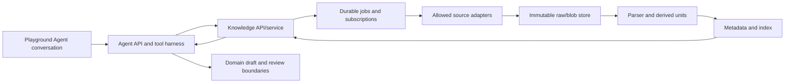

# iFrame Knowledge Platform: Architecture Design v1

Status: proposed architecture, partially implemented (initial PostgreSQL schema and owner collection API). Date: 2026-10-10. Normative behavior is in [the spec](2026-10-10-iframe-knowledge-platform-spec-v1.md); delivery steps are in [the plan](2026-10-10-iframe-knowledge-platform-development-plan-v1.md).

## Current architecture and insertion points

`src/apps/comic_gen/api.py` owns the FastAPI app and includes the Agent, Playground, Recreation, Avatar and identity routers. `src/apps/agent_api.py` handles authenticated chat and builds a single completion request. Playground's Agent UI uses `useAgentConversation.ts` and `agentRequest()` in `frontend/src/lib/api.ts`. `agent_skills.py` serves curated prompt instructions, not executable tools. Studio project state and lineage live in `comic_gen/pipeline.py` and `models.py`; `structured_evidence.py` is project-script evidence only. `studio_access.py` enforces owner-scoped legacy Studio resources and signs private media access.

Do not graft knowledge into the process-wide Studio `pipeline` or the skills catalog. Add a domain-neutral knowledge service and a small Agent tool orchestration layer. Existing project consumers call that service through typed requests, preserving their current apply/confirmation paths.

## Component ownership

| Component | Owner and boundary |
|---|---|
| `src/apps/knowledge/api.py` | Authenticated `/knowledge` API: collections, imports, refresh status, revisions, search, source previews, claim review. Every read/mutation resolves owner and scope server-side. |
| `src/apps/knowledge/store.py` | Transactional PostgreSQL metadata, jobs, revisions, unit/claim/usage records and publication decisions. Queries derive the effective public plus owner/project collection set from authenticated identity. |
| `src/apps/knowledge/blob_store.py` | Immutable raw and extracted media in private COS object namespaces for curated public and owner/project material. Short-lived preview access follows API authorization; no direct public `/files` path or public COS bucket. |
| `src/apps/knowledge/connectors/` | Allowlisted fetch adapters. Web article, uploaded file, and later SEC/policy/market adapters share a fetch result schema but retain source-specific semantics. |
| `src/apps/knowledge/discovery.py` | Optional configured public-search provider adapter. Returns bounded candidate metadata and provider provenance; has no import, crawl or citation authority. |
| `src/apps/knowledge/ingest.py` | Raw capture, parser dispatch, normalization, text/image/table units, derived summaries, idempotency and index publication. Parser failures preserve raw bytes and explicit partial/failure state. |
| `src/apps/knowledge/search.py` | Scope filtering, keyword index, bounded result packaging, retrieval logging and evidence locators. Semantic retrieval is an optional adapter behind the same result schema. |
| `src/apps/knowledge/worker.py` | Durable leased jobs and subscription scheduler, including restart recovery, retry/backoff, pause, rate budgets and metrics. It is not `ExtractionJobs` or FastAPI `BackgroundTasks`. |
| `src/apps/agent_tools.py` | Registered typed tool definitions, authorization and call budget for `knowledge.discover`, `knowledge.search`, `knowledge.import`, `knowledge.status`, `knowledge.review`; model requests cannot call arbitrary URLs or code. |
| Domain adapters | Screenwriting/Director/art/editing/quality and finance select query scope, rank hints, applicability checks, and target draft handoff. They cannot alter source authority or cross-owner filters. |

## Persistent state and version rules

For the shared demo, use a dedicated PostgreSQL database/schema for knowledge metadata and private Tencent Cloud COS buckets/prefixes for content-addressed raw blobs and extracted media. The API and worker share that durable state; application instances have no authoritative local knowledge files. A source key is `(collection_id, canonical_uri_or_upload_id)`; raw revision identity is `(source_id, raw_sha256)`. Imports with unchanged bytes reuse the current revision and log an attempted refresh. Parser/index revisions are separate so reprocessing old bytes is traceable. Only a fully indexed revision becomes the default current retrieval target; failed/new partial revisions do not erase prior searchable evidence. Historical queries may pin exact revisions.

Tables at minimum: collections, collection_publications, sources, source_revisions, content_units, assets, derived_artifacts, claim_assessments, personal_overlays, index_revisions, ingestion_jobs, subscriptions, retrieval_runs, knowledge_uses. An overlay belongs to one owner and may reference an exact public unit revision without modifying it. Foreign keys connect every derived item to the exact raw revision. Uniqueness and transaction boundaries enforce idempotency; caller-provided owner IDs are ignored. PostgreSQL full-text index rows carry scope and source revision keys. Search first constrains authorized source/unit/overlay IDs in SQL, then ranks; a post-search filter alone is insufficient. Publication and index-pointer changes are transactional; COS writes may precede the database commit, with orphan cleanup after failed transactions.

Owner-private and project scopes are enforced from `UserContext.owner_profile_id` on every API and worker job. The default read set is published public collections plus the authenticated owner's collections; an authenticated project context adds only that owner's authorized project collections. A public-reference collection is curated by a platform role and an explicit publishing workflow; a user's imported material does not become public because it has a public URL. A personal item proposed for public use is copied or linked into a distinct reviewed public source record, preserving its private origin and permission history. Project IDs are validated against the authenticated Studio project before linking. Retrieval results never expose raw blob paths. Existing signed Studio media conventions are reused only through a new knowledge-aware handler after checking owner and asset identity.

Search merges authorized hits into one response but returns `collection_scope`, collection/source IDs, exact revisions, and an explicit public/private/project label per hit. A canonical URL or blob hash is not an access key. Duplicate presentation can group equivalent passages, while keeping separate private notes, claims and conflicting revisions visible. Public material has no automatic truth or ranking precedence; owner notes have no automatic evidentiary precedence. Query logs and cached result keys include effective collection-set revision and owner/project identity, so a shared cache cannot return another owner's hits.

## Agent interaction

The current Agent completion path is one model call with optional user media. Add a bounded tool loop only for registered knowledge tools: model proposes a typed call; server validates schema, owner, URL/source policy, per-turn call count and result size; service runs or schedules it; model sees a compact tool result. Long imports return a job ID, not a blocking article payload. Tool outputs are untrusted data. The final message includes stable citation IDs that the UI can resolve and display, including source version and rights state. Tool calls and citations are persisted with the conversation turn, while durable job data lives in the knowledge service.

Read-only search can run during an ordinary task when scope is known. Import, subscription change, public publication, and attaching an image as a generation input are explicit user actions and auditable. The Agent cannot silently enlarge crawl scope. Existing companion mode and H3 Context-IR remain outside this loop until their own contracts are defined.

The domain adapter supplies a `KnowledgeQueryContext` with domain, task, project/series/episode IDs, scene or time range, relevant artifact revisions, allowed collections, and query text. The result has a common `KnowledgeContext` containing cited excerpts/media previews, applicability flags and conflicts. Screenwriting, Director, art, editing, quality and finance can each compose that context at their draft creation boundary. Only an explicit `KnowledgeUse` accepted by the user is linked into the saved target draft/lineage; retrieval alone does not pin knowledge into an artifact. For existing `ArtifactLineage`, add an optional knowledge-use reference list through a focused schema migration, leaving legacy records as unpinned rather than inventing history.

## Source adapter, parser and trust design

`knowledge.discover` queries a configured public-search provider and returns candidate metadata with its own provider/time record; `knowledge.search` queries only imported source units. A candidate has no citation or trusted-source status. The web connector initially accepts an explicit URL from a user or a selected candidate. It checks scheme, host allowlist or source policy, DNS/redirect destination, byte/MIME limits, timeouts, robots/access constraints and per-host rate budget before fetch. It stores original HTML and resolves relevant image URLs through the same policy. URL content is never executable configuration. For documents, a parser adapter may use Docling after a local benchmark; web extraction may use Crawl4AI after the same source-policy checks. Neither library owns iFrame's metadata, authorization, source version or trust status.

The source parser emits ordered `ContentUnit`s plus parent relationships. A text figure reference links an image unit to surrounding text and its actual caption; generated visual description is a `DerivedArtifact` with model version. Paper metadata includes DOI/version/retraction when verifiable, but no field is silently set to "peer reviewed" or "replicated" from a filename. `ClaimAssessment` keeps identity, support, method, applicability, freshness and rights as separate dimensions with reasons and reviewers. FTS/embedding scores are relevance measures only. Financial facts use a separate typed facts projection with fiscal period, basis, unit and currency; general RAG text is not a substitute.

## API sketch

| Route | Response and behavior |
|---|---|
| `POST /knowledge/collections` | Create owner/project collection after scope validation; public creation requires a curator role. |
| `POST /knowledge/discover` | Search configured public provider; return bounded candidates and access metadata, never evidence citations. |
| `POST /knowledge/sources/import` | Explicit URL or upload import; returns durable job and source IDs. |
| `GET /knowledge/jobs/{id}` | Owner-scoped state, phase, partial failures, retryability and timestamps. |
| `GET /knowledge/sources/{id}/revisions` | Source metadata and immutable versions; preview uses separate authenticated asset route. |
| `POST /knowledge/search` | Bounded cited text/image/table hits with scope/domain/task filters and retrieval-run ID. |
| `POST /knowledge/claims/{id}/review` | Candidate/reviewed/rejected state with expected revision, actor and reason. |
| `PUT /knowledge/subscriptions/{id}` | Owner-controlled refresh interval, pause/resume and source bounds. |
| `GET /knowledge/uses?artifact_id=...` | Knowledge-use lineage for a saved creative/financial artifact. |
| `POST /knowledge/overlays` | Add or revise a private note/correction linked to an authorized public revision; never mutates that revision. |
| `POST /knowledge/publications` | Curator-only review and publish/retire action with source revision, rights decision and audit record. |

The API is not the main end-user workflow; the Agent invokes these operations through a smaller registered tool surface and the UI exposes source/claim review where needed. No endpoint accepts an arbitrary filesystem path. Schema and status errors distinguish invalid input, denied source, fetch failure, parse partial, index failure, stale revision and owner mismatch.

## Failure and deployment boundaries

The worker claims persistent jobs with a lease and heartbeat; on restart, expired leases become retryable after checking idempotency keys. Backoff and per-host budgets prevent repeated failures from monopolizing workers. Source refresh and index publish are separate states. Summary/model failures do not discard parsed source units. Stop/pause changes future scheduling, not an already completed snapshot. Backups include metadata and raw blobs together; index and summaries are rebuildable from pinned sources when parser/model versions are retained.

The first demo targets a shared deployment: iFrame API instances, an independent ingestion/scheduler worker, TencentDB for PostgreSQL, and private Tencent Cloud COS. PostgreSQL holds metadata, publication state, job leases, subscriptions, full-text search and audit records; COS holds original bytes and extracted media. The worker uses database leases so restart or multiple instances cannot silently drop work. API and worker use separate least-privilege credentials, private network access where available, encrypted transport, managed backups and monitored storage/queue growth. Exact TencentDB/COS product configuration, region, quotas, backup retention and network settings must be validated before provisioning; this document does not claim they are already deployed. The existing `ExtractionJobs` in-process executor and current Playground JSON files do not supply the required shared durability.

## Decisions requiring empirical verification

- Select parser libraries after an illustrated HTML page, a scanned/structured PDF paper, and an XBRL/financial report fixture are parsed with location fidelity checks.
- Select keyword-only versus hybrid retrieval after domain-specific relevance and citation evaluation; measure image/figure association separately.
- Validate source rights and retention settings for each connected website and article type. A public URL is not a redistribution license.
